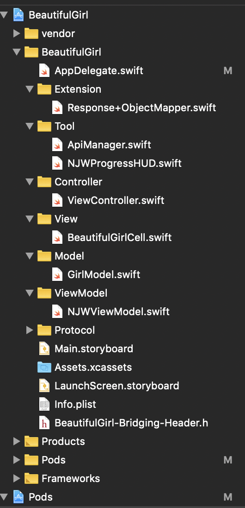
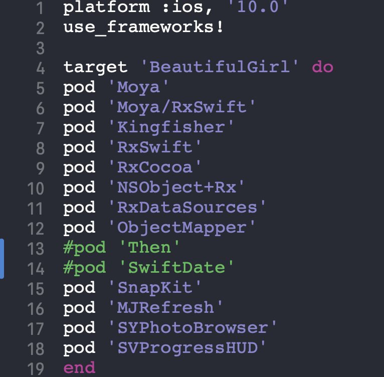

# RxSwift + MVVM 初体验

## 原起
作为一名iOS开发者，必须跟上时代的潮流，随着swift **ABI**越来越稳定，使用swift开发iOS APP 的人越来越多。从网上看了很多文章，也从**github**上下载了很多demo进行代码学习。最近使用**RxSwift+MVVM+Moya**进行了swift的体验之旅。加入到swift开发的大潮中去。

## 目录结构

这个demo的项目结构包括：**View**、**Model**、**ViewModel**、**Controller**、**Tool**、**Extension**。

**ViewModel**是**MVVM**架构模式与**MVC**架构模式最大的区别点。MVVM架构模式把业务逻辑从**controller**集中到了**ViewModel**中，方便进行**单元测试**和**自动化测试**。

ViewModel的业务模型如下：

 
 
 viewmodel相当于是一个黑盒子，封装了业务逻辑，进行输入和输出的转换。
 其中**View**、**Model**与**MVC**架构模式下负责的任务相同。**controller**由于业务逻辑移到了**Viewmodel**中，它本身担起了**中间调用者**角色，负责把**View**和**Viewmodel**绑定在一起。
 
demo的整体目录结构如下：


## 使用到的第三方库

开发一个App最基本的三大要素：**网络请求**、**数据解析**、**UI布局**，其它的都是这三大要素相关联的，或者更细的功能划分。

- 网络请求库使用的**Moya**，
- 数据解析使用的是**ObjectMapper**，
- UI布局使用的是自动布局框架**Snapkit**，
- 图片加载和缓存使用的是**Kingfisher**，
- 刷新组件使用的**MJRefresh**，
- 网络加载提示使用的是**SVProgressHUD**。

使用到的三方库的cocoapod目录如下：

## 具体实现
### viewmodel的协议

viewmodel的实现需要继承**NJWViewModelType**这个协议，需要实现**输入->输出**这个方法。这个算是viewmodel的一个基本范式吧。
``` swift
protocol NJWViewModelType {
    associatedtype Input
    associatedtype Output
    
    func transform(input: Input) -> Output
}
```
### viewmodel的具体实现

这里包括了**输入**、**输出**的具体实现，与及`func transform(input: NJWViewModel.NJWInput) -> NJWViewModel.NJWOutput `这个输入转输出方法具体的实现逻辑。具体代码如下：

```swift
class NJWViewModel: NSObject {
    
    let models = Variable<[GirlModel]>([])
    var index: Int = 0
}

extension NJWViewModel: NJWViewModelType{
    
    typealias Input = NJWInput
    typealias Output = NJWOutput
    
    struct NJWInput {
        
        var category = BehaviorRelay<ApiManager.GirlCategory>(value: .GirlCategoryAll)
        init(category: BehaviorRelay<ApiManager.GirlCategory>) {
            self.category = category
        }
    }
    
    struct NJWOutput {
        
        let sections: Driver<[NJWSection]>
        let requestCommand = PublishSubject<Bool>()
        let refreshStatus = Variable<NJWRefreshStatus>(.none)
        
        init(sections: Driver<[NJWSection]>) {
            self.sections = sections
        }
    }
    
    func transform(input: NJWViewModel.NJWInput) -> NJWViewModel.NJWOutput {
        let sections = models.asObservable().map{ (models) -> [NJWSection] in
            return [NJWSection(items: models)]
        }.asDriver(onErrorJustReturn: [])
        
        let output = Output(sections: sections)
        input.category.asObservable().subscribe{
          
            let category = $0.element
            
            output.requestCommand.subscribe(onNext: { [unowned self] isReloadData in
                self.index = isReloadData ? 0 : self.index + 1
                NJWNetTool.rx.request(.requestWithcategory(type: category!, index: self.index))
                    .asObservable()
                    .mapArray(GirlModel.self)
                    .subscribe({[weak self] (event) in
                        switch event{
                            
                        case let .next(modelArr):
                            self?.models.value = isReloadData ? modelArr : (self?.models.value ?? []) + modelArr
                            NJWProgressHUD.showSuccess("加载成功")
                        case let .error(error):
                            NJWProgressHUD.showError(error.localizedDescription)
                        case .completed:
                            output.refreshStatus.value = isReloadData ? NJWRefreshStatus.endHeaderRefresh : NJWRefreshStatus.endFooterRefresh
                        }
                    }).disposed(by: self.rx.disposeBag)
            }).disposed(by: self.rx.disposeBag)
            
        }.disposed(by: rx.disposeBag)
        
        return output
    }
}
```
### controller中数据绑定的具体实现

把**输入**、**输出**和`collectionview`进行绑定，建立联系，达到操作UI进行数据刷新的目的。具体的绑定逻辑如下：

``` swift
fileprivate func bindView(){
        
        let vmInput = NJWViewModel.NJWInput(category: self.category)
        let vmOutput = viewModel.transform(input: vmInput)
        vmOutput.sections.asDriver().drive(collectionView.rx.items(dataSource: dataSource)).disposed(by: rx.disposeBag)
        vmOutput.refreshStatus.asObservable().subscribe(onNext: {[weak self] status in
            switch status {
            case .beingHeaderRefresh:
                self?.collectionView.mj_header.beginRefreshing()
            case .endHeaderRefresh:
                self?.collectionView.mj_header.endRefreshing()
            case .beingFooterRefresh:
                self?.collectionView.mj_footer.beginRefreshing()
            case .endFooterRefresh:
                self?.collectionView.mj_footer.endRefreshing()
            case .noMoreData:
                self?.collectionView.mj_footer.endRefreshingWithNoMoreData()
            default:
                break
            }
        }).disposed(by: rx.disposeBag)
        
//        Observable.zip(collectionView.rx.itemSelected, collectionView.rx.modelSelected(GirlModel.self)).bind(onNext: {[weak self] indexPath, itemModel in
//            var phtoUrlArray: Array<String> = []
//            phtoUrlArray.append(itemModel.image_url)
//            let photoBrowser: SYPhotoBrowser = SYPhotoBrowser(imageSourceArray: phtoUrlArray, caption: nil, delegate: self)
////                photoBrowser.prefersStatusBarHidden = false
////            photoBrowser.pageControlStyle = SYPhotoBrowserPageControlStyle
//            photoBrowser.initialPageIndex = UInt(indexPath.item)
//            UIApplication.shared.delegate?.window?!.rootViewController?.present(photoBrowser, animated: true)
//        }).disposed(by: disposeBag)
        collectionView.rx.modelSelected(GirlModel.self).subscribe(onNext:{[weak self] itemModel in

            print("current selected model is \(itemModel)")
            let photoBrowser: SYPhotoBrowser = SYPhotoBrowser(imageSourceArray: [itemModel.image_url], caption: nil, delegate: self)
            //                photoBrowser.prefersStatusBarHidden = false
            //            photoBrowser.pageControlStyle = SYPhotoBrowserPageControlStyle
            UIApplication.shared.delegate?.window?!.rootViewController?.present(photoBrowser, animated: true)

        }).disposed(by: disposeBag)
        
        collectionView.mj_header = MJRefreshNormalHeader(refreshingBlock: {
            vmOutput.requestCommand.onNext(true)
//            self.collectionView.reloadData()
        })
        
        collectionView.mj_footer = MJRefreshAutoNormalFooter(refreshingBlock: {
            vmOutput.requestCommand.onNext(false)
        })
    }
```
## 效果展示如下


